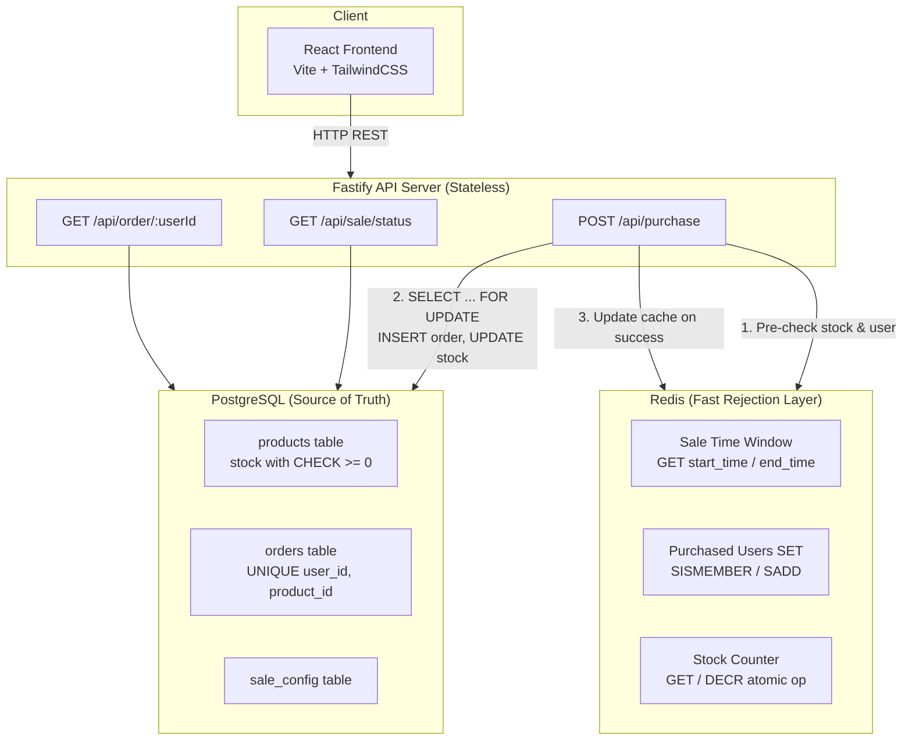
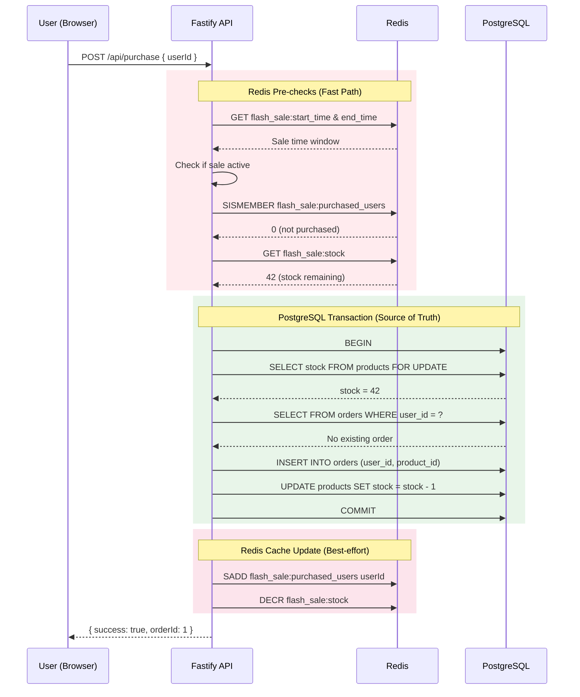
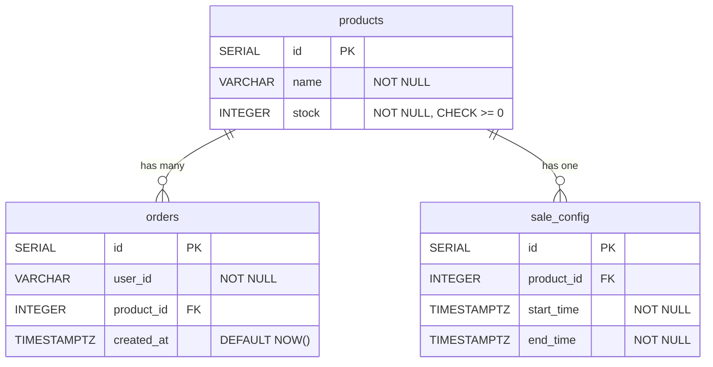

# Flash Sale System

A high-throughput flash sale backend + frontend built with Fastify (TypeScript), React, PostgreSQL, and Redis.

## Demo

<video src="demo.mov" controls width="100%"></video>

## System Architecture



### Purchase Flow — Sequence Diagram



1. **Redis pre-checks (fast path):** Check if sale is active (cached time window), if user already purchased (`SISMEMBER`), and if stock remains (`GET stock counter`). Rejects ~90% of requests without touching the database.
2. **Postgres transaction:** `SELECT ... FOR UPDATE` acquires a row-level lock on the product, verifies stock > 0, checks for existing order, inserts order, decrements stock. All within a single transaction.
3. **Redis cache update:** On successful purchase, `SADD` user to purchased set and `DECR` stock counter.

### Database Entity Relationship Diagram



### Design Decisions & Trade-offs

#### Why Redis as a cache layer, not the source of truth?
Redis is fast (sub-millisecond reads) but volatile — data can be lost on restart. Postgres is slower but durable and ACID-compliant. By using Redis as a **fast rejection layer** in front of Postgres, we get the best of both:
- ~90% of requests are rejected at Redis without touching the DB (already purchased, sold out, sale inactive)
- The remaining ~10% go through a proper Postgres transaction that guarantees correctness

**Trade-off:** Redis can become slightly stale (e.g., a user buys successfully but Redis hasn't updated yet). The worst case is an extra DB query — never an incorrect result, because Postgres is always the final authority.

#### Why `SELECT ... FOR UPDATE` instead of optimistic locking?
Optimistic locking (version columns with retry loops) works well when conflicts are rare. In a flash sale, conflicts are the norm — hundreds of users hitting the same row simultaneously. Pessimistic locking with `FOR UPDATE` is simpler and more predictable here: requests queue up at the DB level and process one at a time. No retry loops, no version mismatch handling.

**Trade-off:** Under extreme load, the row lock becomes a bottleneck since transactions are serialized. For this scale (hundreds of concurrent DB transactions after Redis filtering), it performs well. At 10k+ concurrent DB transactions, we'd need a queue-based approach.

#### Why raw `pg` instead of an ORM (Prisma/Drizzle)?
For a performance-sensitive flash sale system, every millisecond in the transaction matters. Raw SQL with parameterized queries gives us:
- Full control over the exact queries (especially `SELECT ... FOR UPDATE`)
- No ORM overhead or query generation surprises
- Simpler debugging — what you write is what runs

**Trade-off:** Less developer convenience (no auto-migrations, no type-safe query builder). Acceptable for a focused project with 3 tables.

#### Why graceful degradation when Redis is down?
The system continues to work without Redis — all pre-checks are skipped and every request goes directly to Postgres. This is intentional:
- **Availability over performance** — A Redis outage shouldn't cause a total system failure
- **Postgres is always correct** — The `FOR UPDATE` lock and unique constraint still prevent overselling and duplicate purchases
- **Automatic recovery** — When Redis reconnects, the cache layer resumes without manual intervention

**Trade-off:** Without Redis, every request hits Postgres, which increases DB load. But a working system under high DB load is better than a completely broken system.

#### Single product assumption
The database schema supports multiple products, but the Redis caching strategy uses flat keys (`flash_sale:stock`) rather than per-product keys (`flash_sale:stock:{productId}`). This is a deliberate simplification for the flash sale use case. Extending to multiple products would require namespaced Redis keys and per-product locking.

## Prerequisites

- **Docker & Docker Compose** (for PostgreSQL and Redis)
- **Node.js 18+**
- **k6** (for stress testing) — [Install k6](https://grafana.com/docs/k6/latest/set-up/install-k6/)

## Getting Started

### 1. Start Infrastructure

```bash
docker compose up -d
```

This starts PostgreSQL (port 5432) and Redis (port 6379).

### 2. Start Backend

```bash
cd backend
npm install
npm run dev
```

The API server starts on `http://localhost:3000`. On first run, it automatically creates tables and seeds the database with:
- 1 product ("Limited Edition Sneakers") with 100 stock
- A sale window starting now and lasting 1 hour

#### Environment Variables (optional)

| Variable | Default | Description |
|----------|---------|-------------|
| `PORT` | `3000` | API server port |
| `PG_HOST` | `localhost` | PostgreSQL host |
| `PG_PORT` | `5432` | PostgreSQL port |
| `PG_USER` | `flashsale` | PostgreSQL user |
| `PG_PASSWORD` | `flashsale123` | PostgreSQL password |
| `PG_DATABASE` | `flashsale` | PostgreSQL database |
| `REDIS_HOST` | `localhost` | Redis host |
| `REDIS_PORT` | `6379` | Redis port |
| `SALE_STOCK` | `100` | Initial product stock |
| `SALE_START_TIME` | `now` | Sale start time (ISO 8601) |
| `SALE_END_TIME` | `now + 1 hour` | Sale end time (ISO 8601) |

### 3. Start Frontend

```bash
cd frontend
npm install
npm run dev
```

Opens on `http://localhost:5173`. The Vite dev server proxies `/api` requests to the backend.

## Running Tests

### Unit Tests

```bash
cd backend
npm test
```

Tests the sale status determination logic (time window checks) without requiring any infrastructure.

### Integration Tests

Requires Docker (Postgres + Redis) to be running:

```bash
cd backend
npx vitest run tests/integration
```

Tests the full API flow:
- Successful purchase
- Duplicate user rejection
- Out-of-stock rejection
- Sale-not-active rejection
- Order lookup

## Stress Testing

### Prerequisites

Install [k6](https://grafana.com/docs/k6/latest/set-up/install-k6/):

```bash
# macOS
brew install k6

# Or download from https://grafana.com/docs/k6/latest/set-up/install-k6/
```

### Running Stress Tests

Make sure Docker and backend are running before all stress tests.

#### 1. Flash Sale (core test)

500 users compete for 100 items simultaneously. Verifies no overselling.

```bash
cd stress-test
k6 run flash-sale.k6.js

# Custom: 1000 users competing for 100 items
k6 run -e VUS=1000 -e STOCK=100 flash-sale.k6.js
```

**Expected:** Exactly 100 successful purchases, 400 rejected, p95 < 2s.

#### 2. Duplicate Purchase

50 concurrent requests with the **same user ID**. Verifies one-per-user rule under race conditions.

```bash
k6 run duplicate-purchase.k6.js
```

**Expected:** At most 1 successful purchase. All others rejected as "already purchased."

#### 3. Ramp-Up

Gradually increases traffic: 50 → 200 → 500 → 1000 → 0 VUs over 50 seconds. Finds the system's breaking point.

```bash
k6 run ramp-up.k6.js
```

**Expected:** Less than 10 server errors. p95 < 3s even at peak.

#### 4. Sale Status Endpoint

200 VUs polling `GET /api/sale/status` for 30 seconds. Verifies the read-path stays fast.

```bash
k6 run sale-status.k6.js
```

**Expected:** p95 < 500ms. Thousands of requests per second with near-zero errors.

#### 5. Mixed Traffic

300 VUs simulating realistic traffic: 70% status checks, 20% purchases, 10% order lookups.

```bash
k6 run mixed-traffic.k6.js
```

**Expected:** Less than 10 server errors. p95 < 2s across all endpoints.

## Project Structure

```
bookipi-assignment/
  ├── docker-compose.yml        # Postgres + Redis
  ├── backend/
  │   ├── src/
  │   │   ├── index.ts          # Fastify app entry + graceful shutdown
  │   │   ├── config.ts         # Environment config
  │   │   ├── db/
  │   │   │   ├── client.ts     # Postgres pool
  │   │   │   ├── migrate.ts    # Schema migration & seed
  │   │   │   └── schema.sql    # Database schema
  │   │   ├── redis/
  │   │   │   ├── client.ts     # Redis client + fault tolerance
  │   │   │   └── keys.ts       # Redis key constants
  │   │   ├── routes/
  │   │   │   ├── sale.ts       # GET /api/sale/status
  │   │   │   ├── purchase.ts   # POST /api/purchase
  │   │   │   └── order.ts      # GET /api/order/:userId
  │   │   └── services/
  │   │       ├── sale.service.ts
  │   │       └── purchase.service.ts
  │   └── tests/
  │       ├── unit/
  │       └── integration/
  ├── frontend/
  │   └── src/
  │       ├── App.tsx
  │       ├── api.ts
  │       └── components/
  │           ├── SaleStatus.tsx
  │           ├── PurchaseForm.tsx
  │           └── ResultMessage.tsx
  ├── stress-test/
  │   ├── flash-sale.k6.js      # Core: 500 users, 100 stock
  │   ├── duplicate-purchase.k6.js  # Same user 50x concurrently
  │   ├── ramp-up.k6.js         # 50 → 1000 VUs gradual ramp
  │   ├── sale-status.k6.js     # Read-path under load
  │   └── mixed-traffic.k6.js   # Realistic 70/20/10 traffic split
  └── docs/
      └── system-diagram.html   # Architecture + sequence + ER diagrams
```
